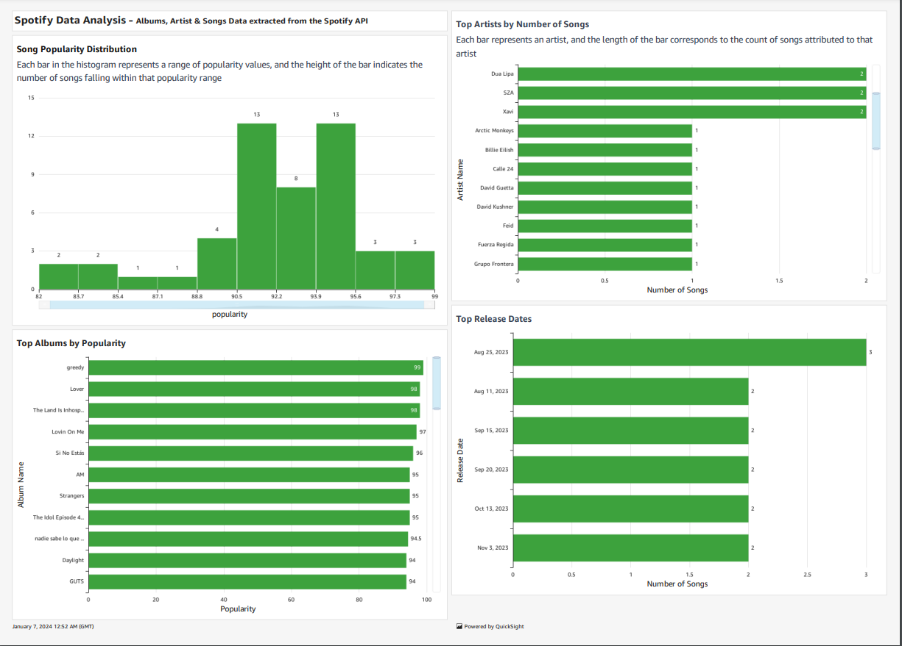

# Spotify-Analysis-using-AWS-cloud-environment

This repository consists of a robust data pipeline that efficiently extracts, transforms, and analyzes Spotify data through the utilization of diverse AWS services. The pipeline will seamlessly integrate with the Spotify API, acquiring pertinent data and storing it systematically on AWS S3. The extraction process will be automated through AWS Lambda, executing scheduled intervals or triggered events.

Upon successful extraction, a dedicated transformation function will be deployed to cleanse and format the data, catering to specific analytical requirements. This function will adeptly handle tasks such as data normalization, aggregation, and filtering.

To enhance the pipeline's efficiency and dependability, an automated trigger will be implemented alongside the transformation function. This trigger will vigilantly monitor changes or updates in the extracted data, triggering the transformation function accordingly.

The processed data will be restore in AWS S3, maintaining meticulous file organization for streamlined access and retrieval. This systematic approach ensures ease of use for subsequent analyses.

To facilitate seamless analytics, the project will encompass the creation of analytics tables using AWS Glue and Athena. These services will play a pivotal role in defining data schemas, enabling efficient querying and analysis of the transformed data.

By deploying this Spotify data pipeline on AWS, the project strives to deliver a scalable, reliable, and automated solution for the extraction, transformation, and analysis of Spotify data. This, in turn, aims to unlock valuable insights for diverse analytical purposes.

## Data Architecture 
[Lucid Chart](https://lucid.app/lucidchart/995410f3-c4fc-4da3-ab55-2b1b2adeb535/view?invitationId=inv_b033e39e-388d-4cc7-b718-7bd4eb577a98&page=0_0#)

 

	  

	 <br

## Required Links :
Spotify for Developer - https://developer.spotify.com/
Create a Free AWS Account - https://portal.aws.amazon.com/gp/aws/developer/registration/index.html?refid=em_127222
Spotipy Library - https://spotipy.readthedocs.io/en/2.22.1/
Spotify Top Songs Global playlist - https://open.spotify.com/playlist/37i9dQZEVXbNG2KDcFcKOF

## Reference:
https://learn.datawithdarshil.com/courses/Python-for-Data-Engineering
